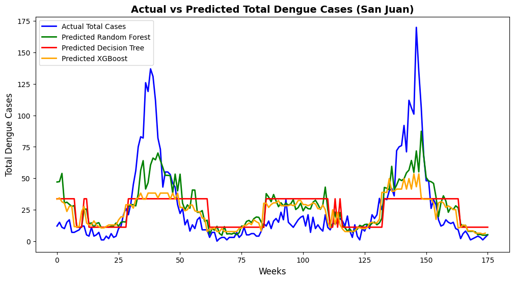
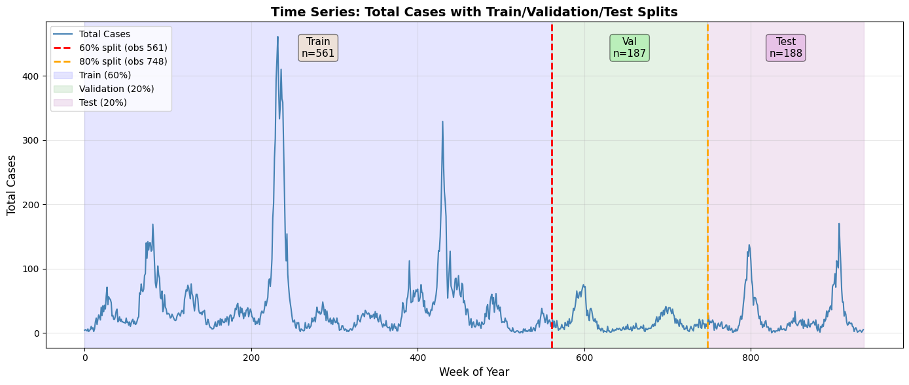

# DengAI: Forecasting Dengue Outbreaks

Predicting weekly dengue fever cases in San Juan, Puerto Rico from climate data, for DrivenData's
[DengAI](https://www.drivendata.org/competitions/44/dengai-predicting-disease-spread/) competition.

**Joshua Owen Mangotang** and **Dastan Nurbekuly**, Machine Learning course, University of South
Brittany, 2025.

<p align="center">
  
</p>

## Overview

Dengue is spread by mosquitoes whose life cycle depends on temperature and rainfall, so weekly
climate records (temperature, humidity, precipitation, vegetation index) can help anticipate
outbreaks. The notebook explores the San Juan data, builds the preprocessing step by step, and
compares a Random Forest with XGBoost, all evaluated on a held-out test period.

<p align="center">
  
</p>

## Results

Each step adds to the previous one (Random Forest unless stated):

| Model | Test MAE | Test RMSE |
| --- | ---: | ---: |
| Raw climate features | 27.96 | 36.81 |
| + lagged features | 23.55 | 30.46 |
| + interpolation of missing values and log-transformed target | 17.05 | 28.98 |
| + seasonal and outbreak-related features | 14.83 | 24.89 |
| Top 5 features only | 14.17 | 21.48 |
| **Final Random Forest (tuned with rolling cross-validation)** | **14.07** | **21.36** |
| XGBoost (tuned) | 15.54 | 25.26 |
| Single decision tree | 18.74 | 28.64 |

Preprocessing and feature engineering halved the error of the raw model, while the choice
between Random Forest and XGBoost changed it far less.

## Repository Structure

```
dengue_forecasting.ipynb   exploration, preprocessing, experiments, tuning and model comparison
presentation.pdf           project presentation
assets/                    figures used in this README
requirements.txt
```

## Usage

Download `dengue_features_train.csv`, `dengue_labels_train.csv` and `dengue_features_test.csv`
from the [competition page](https://www.drivendata.org/competitions/44/dengai-predicting-disease-spread/data/)
into this folder, then:

```bash
pip install -r requirements.txt
jupyter lab dengue_forecasting.ipynb
```
